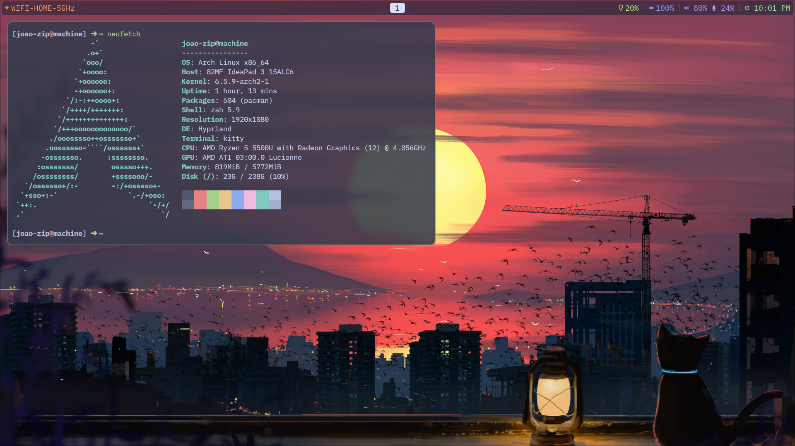

# Dotfiles

That's my actual setup:

DE: [Hyprland](https://hyprland.org/)

Lock Screen: [Sway Lock](https://github.com/swaywm/swaylock)

Bar: [Waybar](https://github.com/Alexays/Waybar)

Text/Code Editor: [LunarVim](https://www.lunarvim.org)

Terminal: [Kitty](https://sw.kovidgoyal.net/kitty/) and [Zap](https://www.zapzsh.org/)

File Manager: [lf](https://github.com/gokcehan/lf)

Hope this help you someday
